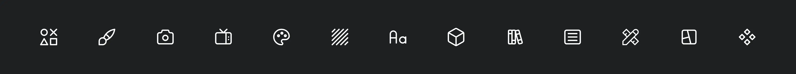

<!-- PROJECT LOGO -->

# Freesets

Freesets is a collection of free, high-quality multimedia resources that you can use in your web projects. Here you will find icons, images, videos, illustrations, fonts and more. All resources has at least one free version or free plan, but please read the license before using them. You can contribute to this project by suggesting new resources or making a pull request.

  <a href="https://github.com/cosmoart/Freesets?tab=readme-ov-file#contributing">Contribute</a>
  ·
  <a href="https://github.com/cosmoart/Freesets/issues">Report Bug</a>
  ·
  <a href="https://github.com/cosmoart/Freesets/discussions">Request Feature</a>

## Contributing

You can contribute to this project:

- Suggesting Resources: If you have ideas for new resources or enhancements, please open a [new issue](https://github.com/cosmoart/Freesets/pulls) or [start a discussion](https://github.com/cosmoart/Freesets/discussions/new/choose).
- Submitting Changes: Feel free to create a pull request with improvements or fixes for the website.

## License

Web code distributed under the MIT License. See `LICENSE` for more information.