

<!-- PROJECT LOGO -->

# Free multimedia resources

This repository contains a collection of free, high-quality multimedia resources that you can use in your projects. Here you will find icons, photos, videos, illustrations, patterns and more. All resources have at least one free plan and they are ordered by quality.

I hope you enjoy these resources and if you have any suggestions, please post them in the [discussion section](https://github.com/cosmoart/free-multimedia-resources/discussions) or if you find any errors, please report them in the [issues section](https://github.com/cosmoart/free-multimedia-resources/issues).

  <a href="https://github.com/cosmoart/free-multimedia-resources">Contribute</a>
  ·
  <a href="https://github.com/cosmoart/free-multimedia-resources/issues">Report error</a>
  ·
  <a href="https://github.com/cosmoart/free-multimedia-resources/discussions">Suggest resource</a>

<!-- TABLE OF CONTENTS -->
## Table of contents

- [Icons](#-icons)
- [Ilustrations](#%EF%B8%8F-ilustrations)
- [Photos](#-photos)
- [Videos](#-videos)
- [Backgrounds/Patterns](#%EF%B8%8F-backgroundspatterns)
- [Loaders](#-loaders)

<h2>🏠 Icons</h2>

<table>
<tr>
		<td><a href="https://fonts.google.com/icons">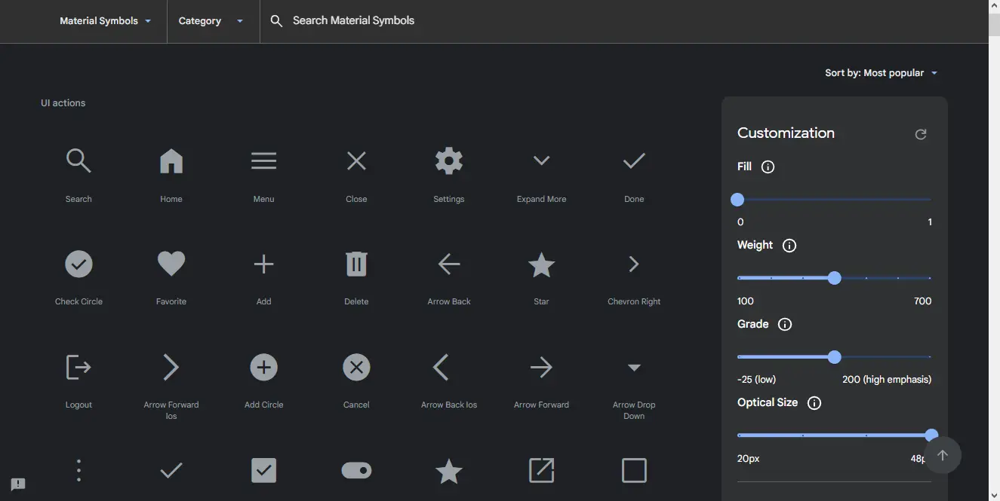</a></td><td></td><td><a href="https://heroicons.com/">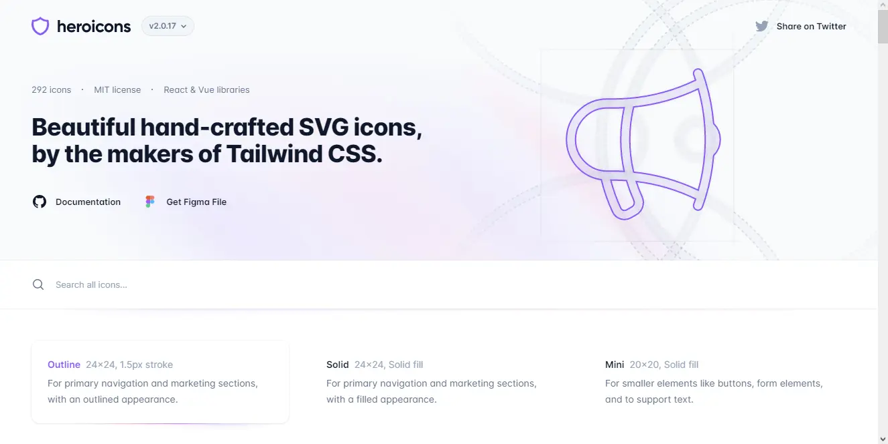</a></td>
	</tr>
	<tr>
		<td><a href="https://fonts.google.com/icons">Google icons</a></td><td><a href="https://tabler-icons.io">Tabler icons</a></td><td><a href="https://heroicons.com/">Hero icons</a></td>
	</tr>
	<tr>
		<td>Over 2,500 glyphs in a single font file with a wide range of design variants. </td><td>Free and open source icons designed to make your website or app attractive, visually consistent and simply beautiful.</td><td>Beautiful hand-crafted SVG icons, by the makers of Tailwind CSS.</td>
	</tr>
	<tr>
		<td><a href="https://www.apache.org/licenses/LICENSE-2.0.html">Licence: Apache License Version 2.0</a> </td><td><a href="https://github.com/tabler/tabler-icons/blob/master/LICENSE">Licence: MIT</a></td><td><a href="https://github.com/tailwindlabs/heroicons/blob/master/LICENSE">Licence: MIT</a></td>
	</tr><tr>
		<td></td><td></td><td><a href="https://feathericons.com/">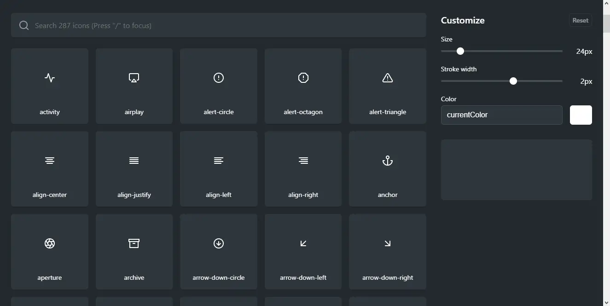</a></td>
	</tr>
	<tr>
		<td><a href="https://remixicon.com/">Remix icons</a></td><td><a href="https://css.gg/">css.gg</a></td><td><a href="https://feathericons.com/">Feather icons</a></td>
	</tr>
	<tr>
		<td>Remix Icon is a set of open source neutral style system symbols elaborately crafted for designers and developers.</td><td>Open-source CSS, SVG and Figma UI Icons, Available in SVG Sprite, styled-components, NPM & API</td><td>Simply beautiful open source icons</td>
	</tr>
	<tr>
		<td><a href="https://github.com/Remix-Design/RemixIcon/blob/master/License">Licence: Apache License Version 2.0</a> </td><td><a href="https://css.gg/doc/licence">Licence: MIT</a></td><td><a href="https://github.com/feathericons/feather/blob/master/LICENSE">Licence: MIT</a></td>
	</tr><tr>
		<td></td><td><a href="https://iconmonstr.com">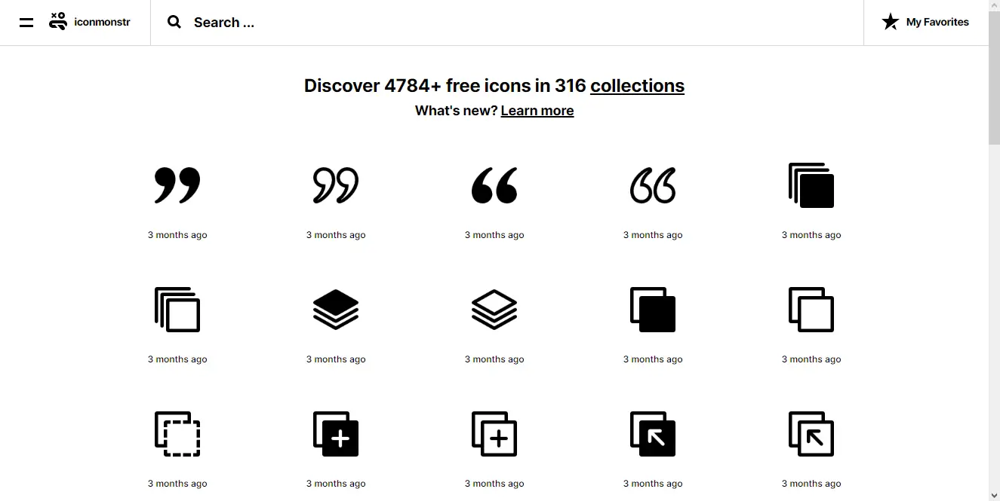</a></td><td><a href="https://keyicons.com">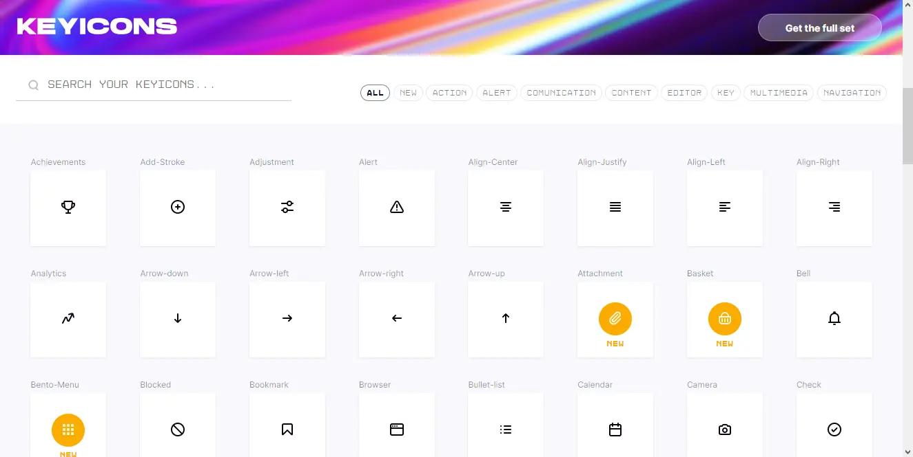</a></td>
	</tr>
	<tr>
		<td><a href="https://www.svgrepo.com">SVGrepo</a></td><td><a href="https://iconmonstr.com">Iconmonstr</a></td><td><a href="https://keyicons.com">Keyicons</a></td>
	</tr>
	<tr>
		<td>500.000+ Open-licensed SVG Vector and Icons</td><td>Free simple icons for your next project</td><td>The clean icon set you were looking for, ready to use in web, mobile development and wherever you want.</td>
	</tr>
	<tr>
		<td><a href="https://www.svgrepo.com/page/licensing">Licence: Multiple licenses (SVG Repo License, CC0, MIT...)</a> </td><td><a href="https://iconmonstr.com/license/">Licence: "Licensee may use the Work in non-commercial and commercial projects, services or products without attribution."</a></td><td><a href="https://keyicons.com">Licence: CC BY 4.0</a></td>
	</tr><tr>
		<td><a href="http://zwicon.com">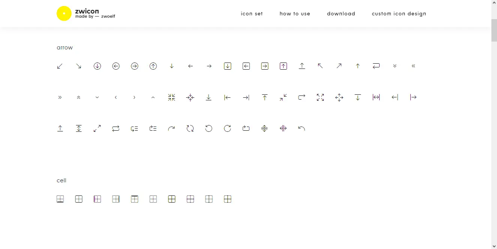</a></td>
	</tr>
	<tr>
		<td><a href="http://zwicon.com">Zwicon</a></td>
	</tr>
	<tr>
		<td>The zwicon icon library was made to support our work @zwoelf. Now it is available for free for download.</td>
	</tr>
	<tr>
		<td><a href="http://zwicon.com/how-to-use.html">Licence: CC BY-ND 4.0</a> </td>
	</tr>
</table>

<h2>🖍️ Ilustrations</h2>

<table>
<tr>
		<td></td><td></td><td></td>
	</tr>
	<tr>
		<td><a href="https://www.reshot.com/free-vector-illustrations/">Reshot</a></td><td><a href="https://undraw.co/illustrations">unDraw</a></td><td><a href="https://designs.ai/graphicmaker">Designs AI</a></td>
	</tr>
	<tr>
		<td>Download free vector illustrations for commercial use with no attribution so you can design freely.</td><td>The design project with open-source illustrations for any idea you can imagine and create.</td><td>Get beautiful and customizable SVG, PNG and Vector illustrations that match you brand identity.</td>
	</tr>
	<tr>
		<td><a href="https://www.reshot.com/license/">Licence: Reshot Free License</a> </td><td><a href="https://undraw.co/license">Licence: "You can use the illustrations in any project, commercial or personal without attribution or any costs"</a></td><td><a href="https://designs.ai/dos-and-donts">Licence: "Free for Personal and Commercial usage with attribution."</a></td>
	</tr><tr>
		<td><a href="https://iradesign.io">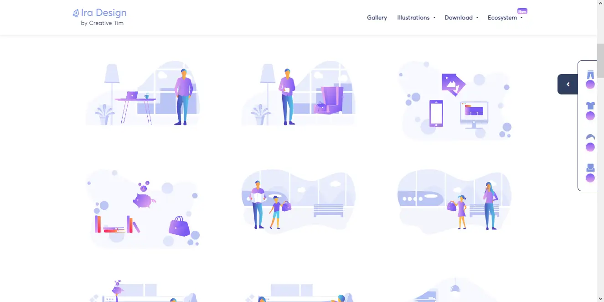</a></td><td></td><td></td>
	</tr>
	<tr>
		<td><a href="https://iradesign.io">Iradesign</a></td><td><a href="https://www.opendoodles.com">Open Doodles</a></td><td><a href="https://bigheads.io">Big Heads</a></td>
	</tr>
	<tr>
		<td>Build your own amazing illustrations with MIT licensed illustrations</td><td>A library of sketchy illustrations of people free for personal and commercial use.</td><td>Randomly Generated Characters for Your Apps & Games.</td>
	</tr>
	<tr>
		<td><a href="https://iradesign.io">Licence: MIT</a> </td><td><a href="https://www.opendoodles.com">Licence: CC0 1.0</a></td><td><a href="https://bigheads.io">Licence: "Free for personal and commercial use."</a></td>
	</tr><tr>
		<td></td><td></td><td></td>
	</tr>
	<tr>
		<td><a href="https://www.manypixels.co/gallery">Many Pixels</a></td><td><a href="https://www.humaaans.com/">Humaaans</a></td><td><a href="https://fresh-folk.com">Fresh Folk</a></td>
	</tr>
	<tr>
		<td>Download our 2,500+ editable and royalty-free SVG and PNG illustrations to power up your designs.</td><td>Mix-&-match illustrations of people with a design library for InVIsion Studio and Sketch.</td><td>An illustration library of people and objects.</td>
	</tr>
	<tr>
		<td><a href="https://www.manypixels.co/gallery">Licence: "You can use the illustrations in any project, commercial or personal without attribution or any costs."</a> </td><td><a href="https://www.humaaans.com/">Licence: CC0</a></td><td><a href="https://fresh-folk.com">Licence: CC BY-NC-ND 4.0</a></td>
	</tr><tr>
		<td></td><td><a href="https://storyset.com">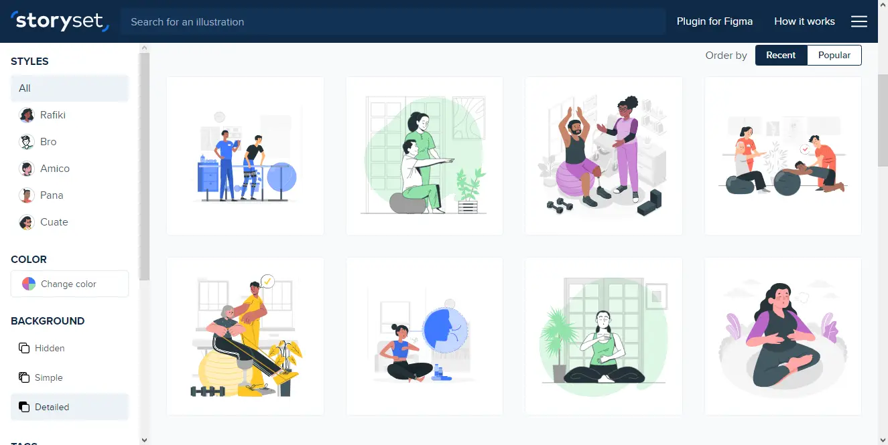</a></td><td><a href="https://themeisle.com/illustrations/">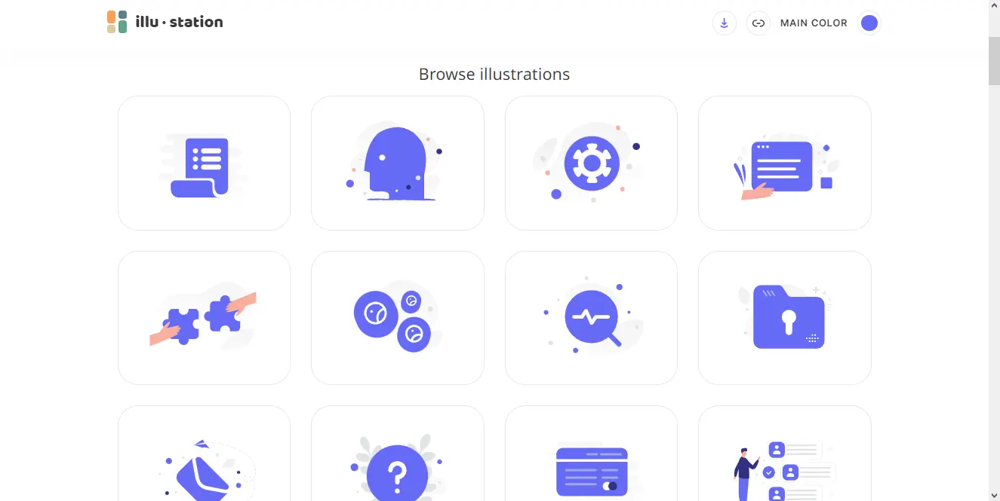</a></td>
	</tr>
	<tr>
		<td><a href="https://flexiple.com/illustrations/">Flexiple ilustrations</a></td><td><a href="https://storyset.com">Storyset</a></td><td><a href="https://themeisle.com/illustrations/">Theme Isle</a></td>
	</tr>
	<tr>
		<td>A new free, open-source and high-quality illustration each day - no attribution needed!</td><td>Awesome free customizable illustrations for your next project</td><td>Find & Download the most popular Illustrations ✓ Free for commercial use ✓ High Quality Images ✓ Made for Creative Projects.</td>
	</tr>
	<tr>
		<td><a href="https://flexiple.com/illustrations/">Licence: "Put simply, use it in any project. No attribution needed."</a> </td><td><a href="https://storyset.com/faqs">Licence: Free for Personal and Commercial usage with attribution.</a></td><td><a href="https://themeisle.com/illustrations/">Licence: "All images and vectors published on Themeisle can be used for free. You can use them for noncommercial and commercial purposes."</a></td>
	</tr><tr>
		<td></td><td></td>
	</tr>
	<tr>
		<td><a href="https://www.drawkit.com/?pricing-type=Free">DrawKit</a></td><td><a href="https://delesign.com/free-designs/graphics/illustration">Delesign</a></td>
	</tr>
	<tr>
		<td>REQUIRE LOGIN TO USE. Browse all our creative contents. 2D illustrations, icons, 3D, animations, mockups and many more.</td><td>REQUIRE LOGIN TO USE. Use our royalty-free Illustrations for your website, social media, blog, email newsletters, and anything else.</td>
	</tr>
	<tr>
		<td><a href="https://www.drawkit.com/license">Licence: DrawKit License (Free for Personal and Commercial. No attribution required.)</a> </td><td><a href="https://delesign.com/free-designs/free-license/">Licence: Delesign License (Free for Personal and Commercial. No attribution required.)</a></td>
	</tr>
</table>

<h2>📷 Photos</h2>

<table>
<tr>
		<td></td><td></td><td><a href="https://picography.co">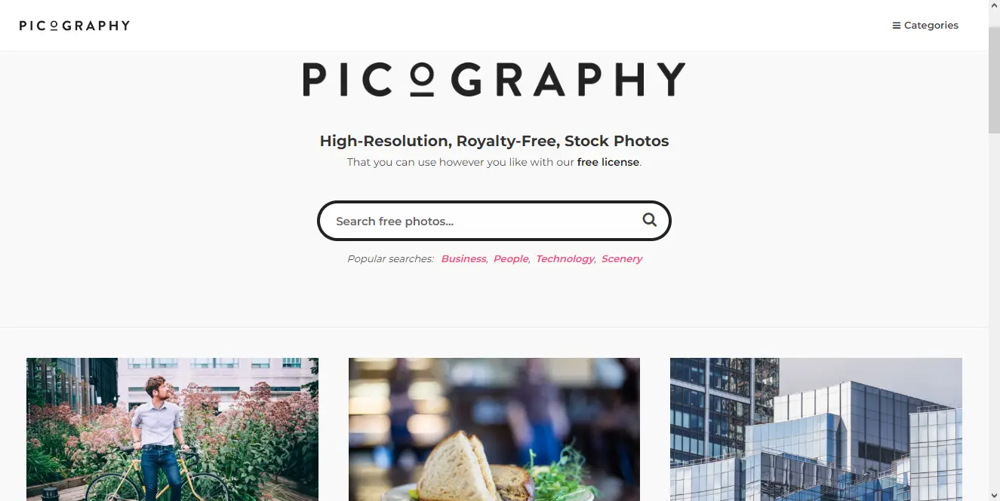</a></td>
	</tr>
	<tr>
		<td><a href="https://pixabay.com/photos/">PixaBay</a></td><td><a href="https://www.pexels.com">Pexels</a></td><td><a href="https://picography.co">Picography</a></td>
	</tr>
	<tr>
		<td>Find high quality royalty free photos for your next project. ✓ Free for commercial use ✓ No attribution required ✓ Photos handpicked by staff.</td><td>Free stock photos & videos you can use everywhere. Browse millions of high-quality royalty free stock images & copyright free pictures. No attribution required.</td><td>Picography offers gorgeous high-resolution free photos. Our free stock photos can be used for any project. No attribution needed. Download your favorites.</td>
	</tr>
	<tr>
		<td><a href="https://pixabay.com/es/service/license/">Licence: Pixabay License (Free for commercial and noncommercial use. Attribution is not required.)</a> </td><td><a href="https://www.pexels.com/license/">Licence: "All photos and videos on Pexels can be downloaded and used for free."</a></td><td><a href="https://picography.co/terms/">Licence: CC0 1.0</a></td>
	</tr><tr>
		<td></td><td></td><td></td>
	</tr>
	<tr>
		<td><a href="https://unsplash.com">Unsplash</a></td><td><a href="https://stocksnap.io">StockSnap</a></td><td><a href="https://nappy.co">Nappy</a></td>
	</tr>
	<tr>
		<td>The internet’s source of freely-usable images. Powered by creators everywhere.</td><td>The best source for free, CC0, do-what-you-want-with stock photos. No attribution required.</td><td>Beautiful photos of Black and Brown people, for free. For commercial and personal use.</td>
	</tr>
	<tr>
		<td><a href="https://unsplash.com/license">Licence: Free for Commercial and non-commercial purposes. No attribution required.</a> </td><td><a href="https://stocksnap.io/license">Licence: CC0 1.0</a></td><td><a href="https://nappy.co/license">Licence: CC0 1.0</a></td>
	</tr>
</table>

<h2>📺 Videos</h2>

<table>
<tr>
		<td><a href="https://www.pexels.com/videos/">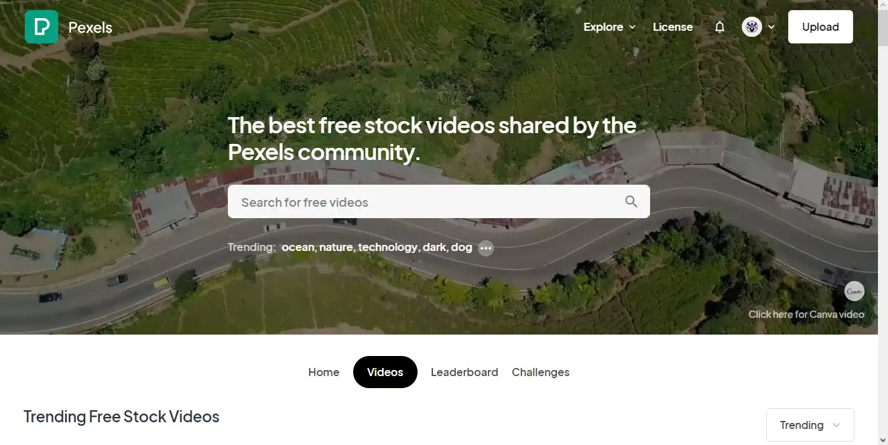</a></td><td><a href="https://coverr.co">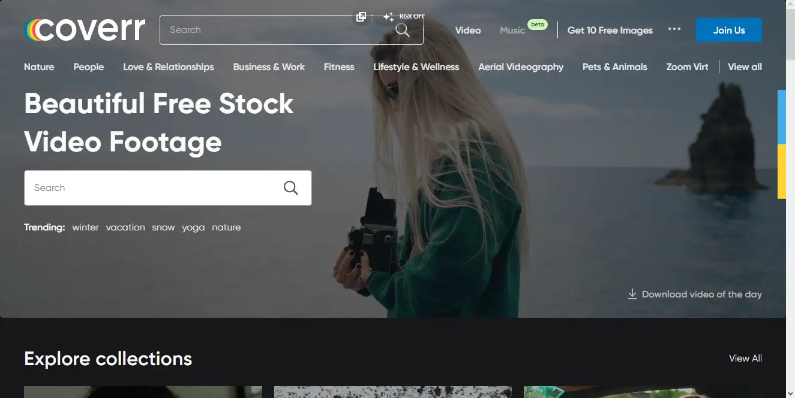</a></td><td></td>
	</tr>
	<tr>
		<td><a href="https://www.pexels.com/videos/">Pexels</a></td><td><a href="https://coverr.co">Coverr</a></td><td><a href="https://www.videezy.com">Videezy</a></td>
	</tr>
	<tr>
		<td>Pexels Videos makes it easy to find free stock footage for your website, promo video or anything else.</td><td>Download royalty free (for personal and commercial use), unique and beautiful video footage for your website or any project. No attribution required.</td><td>Download millions of free and premium stock footage and motion graphics instantly.</td>
	</tr>
	<tr>
		<td><a href="https://www.pexels.com/license/">Licence: "All photos and videos on Pexels can be downloaded and used for free."</a> </td><td><a href="https://coverr.co/license">Licence: "All Videos published on Coverr.co can be used free for commercial and non-commercial purposes. You do not need to ask permission from or provide credit to the videographer or Coverr.co, although it is appreciated when possible."</a></td><td><a href="https://www.videezy.com/terms">Licence: Standard, Pro, Creative Commons and Editorial Use Only</a></td>
	</tr><tr>
		<td></td><td></td>
	</tr>
	<tr>
		<td><a href="https://mixkit.co/free-stock-video/">Mixkit</a></td><td><a href="https://www.videvo.net">Videvo</a></td>
	</tr>
	<tr>
		<td>Browse our library of extraordinary free stock footage and motion clips for every occasion. All HD Video Clips are completely free to download and use anywhere.</td><td>Download Free Stock Footage and HD Video clips; Videvo offers a large selection of HD video clips, motion graphics and free stock footage.</td>
	</tr>
	<tr>
		<td><a href="https://mixkit.co/license/">Licence: "Items under the Mixkit Stock Video Free License can be used in your commercial and non-commercial projects, for free."</a> </td><td><a href="https://help.videvo.net/category/6-licensing">Licence: Videvo Attribution License or Creative Commons 3.0 ("You may use these video clips free of charge, in both personal and commercial productions. Video clips that carry the Creative Commons 3.0 license must be attributed to the original author.")</a></td>
	</tr>
</table>

<h2>🏙️ Backgrounds/Patterns</h2>

<table>
<tr>
		<td></td><td></td><td></td>
	</tr>
	<tr>
		<td><a href="https://www.magicpattern.design/tools/css-backgrounds">CSS Background Patterns</a></td><td><a href="https://pattern.monster">Pattern Monster</a></td><td><a href="https://bansal.io/pattern-css">pattern.css</a></td>
	</tr>
	<tr>
		<td>Beautiful pure CSS background patterns that you can actually use in your projects!</td><td>A simple online pattern generator to create repeatable SVG patterns. Perfect for website backgrounds, apparel, branding, packaging design and more.</td><td>CSS only library to fill your empty background with beautiful patterns.</td>
	</tr>
	<tr>
		<td><a href="https://www.magicpattern.design/terms">Licence: "Free"</a> </td><td><a href="https://github.com/catchspider2002/svelte-svg-patterns/blob/master/LICENSE.md">Licence: MIT</a></td><td><a href="https://github.com/bansal/pattern.css">Licence: MIT</a></td>
	</tr><tr>
		<td></td><td><a href="https://www.heropatterns.com">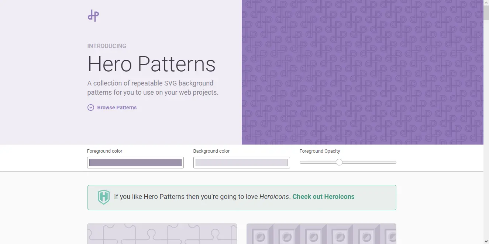</a></td><td></td>
	</tr>
	<tr>
		<td><a href="https://haikei.app/generators/">Haikei</a></td><td><a href="https://www.heropatterns.com">Hero Patterns</a></td><td><a href="https://patternpad.com">PatternPad</a></td>
	</tr>
	<tr>
		<td>Our SVG generators let you discover, customize, randomize, and export generative SVG design assets to use in your favorite design tools.</td><td>A collection of repeatable SVG background patterns for you to use on your web projects.</td><td>PatternPad offers unlimited unique pattern designs that fit your style. Ideal for branding, presentations, social media posts or customising products.</td>
	</tr>
	<tr>
		<td><a href="https://haikei.app/pricing/">Licence: Free</a> </td><td><a href="https://heropatterns.com">Licence: CC BY 4.0</a></td><td><a href="https://patternpad.com">Licence: Free with attribution</a></td>
	</tr>
</table>

<h2>⌛ Loaders</h2>

<table>
<tr>
		<td><a href="https://10015.io/tools/css-loader-generator">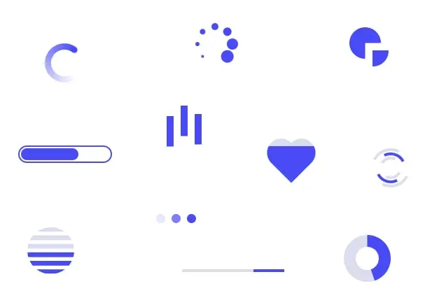</a></td><td><a href="https://uiball.com/loaders/">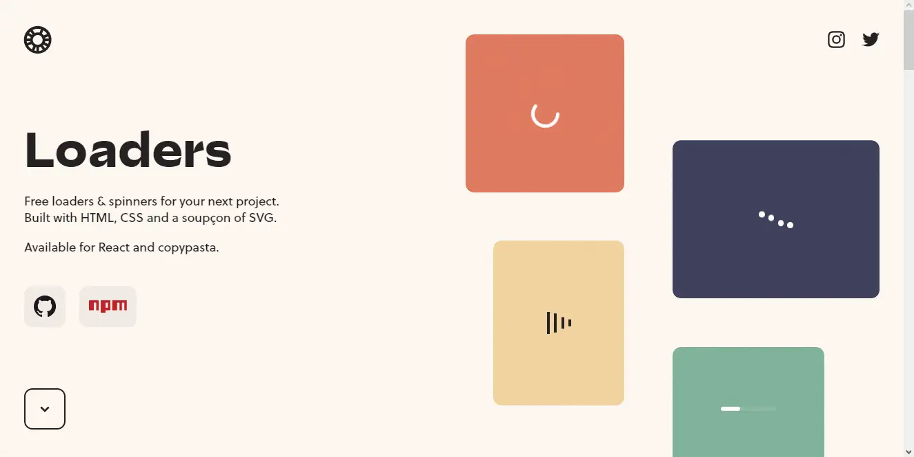</a></td><td></td>
	</tr>
	<tr>
		<td><a href="https://10015.io/tools/css-loader-generator">10015 Tools - CSS Loader Generator</a></td><td><a href="https://uiball.com/loaders/">Loaders</a></td><td><a href="https://loaders.holasvg.com">Hola svg</a></td>
	</tr>
	<tr>
		<td>Online CSS Loader Generator is a free tool for generating CSS loaders</td><td>Free loaders & spinners for your next project. Built with HTML, CSS and a soupçon of SVG. Available for copypasta or as a tree-shakeable React component library.</td><td>Free SVG Loader Generator</td>
	</tr>
	<tr>
		<td><a href="https://10015.io/tools/css-loader-generator">Licence: Free</a> </td><td><a href="https://github.com/GriffinJohnston/uiball-loaders/blob/main/LICENSE">Licence: MIT</a></td><td><a href="https://loaders.holasvg.com">Licence: MIT</a></td>
	</tr><tr>
		<td></td><td></td>
	</tr>
	<tr>
		<td><a href="https://samherbert.net/svg-loaders/">SVG Loaders</a></td><td><a href="https://cssloaders.github.io">CSS loaders and spinners</a></td>
	</tr>
	<tr>
		<td>Loading icons and small animations built with pure SVG.</td><td>CSS Loader is a collection of different types of loaders, spinners and their source code. There are no image dependencies in this. It's is done using pure CSS. Hence it is easily customization too.</td>
	</tr>
	<tr>
		<td><a href="https://github.com/SamHerbert/SVG-Loaders/blob/master/LICENSE.md">Licence: MIT</a> </td><td><a href="https://github.com/vineethtrv/css-loader/blob/master/LICENSE">Licence: MIT</a></td>
	</tr>
</table>

