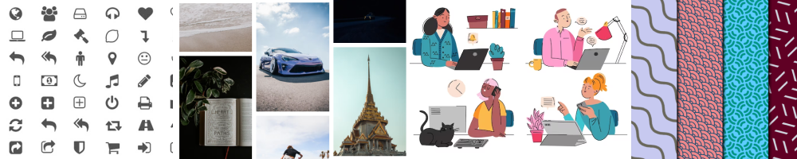

<!-- PROJECT LOGO -->

 

# Web media resources

This repository contains a collection of free, high-quality multimedia resources that you can use in your web projects. Here you will find icons, images, videos, illustrations, sounds and more. All resources are licensed under the Creative Commons or public domain, which means you can use them without asking permission or giving credit to the authors (although it is appreciated). I hope you enjoy these resources and share them with others.

  <a href="https://github.com/cosmoart/free-multimedia-resources">Contribute</a>
  ·
  <a href="https://github.com/cosmoart/free-multimedia-resources/issues">Report Bug</a>
  ·
  <a href="https://github.com/cosmoart/free-multimedia-resources/discussions">Request Feature</a>

<!-- TABLE OF CONTENTS -->
<h2>Table of contents</h2>

- [Icons](#icons)
- [Ilustrations](#ilustrations)
- [Photos](#photos)
- [Videos](#videos)
- [Backgrounds/Patterns](#backgroundspatterns)
- [Loaders](#loaders)

<h2>Icons</h2>

<table>
	<tr>
		<td></td>
		<td></td>
		<td></td>
	</tr>
	<tr>
		<td><a href="https://css.gg/">css.gg</a></td>
		<td><a href="https://feathericons.com/">Feather</a></td>
		<td><a href="https://fontawesome.com/">Font Awesome</a></td>
	</tr>
	<tr>
		<td>A pure CSS library of 1000+ icons</td>
		<td>Simply beautiful open source icons</td>
		<td>The web's most popular icon set and toolkit</td>
	</tr>
	<tr>
		<td><a href="https://creativecommons.org/licenses/by/4.0/">licence: CC BY 4.0</a> </td>
		<td><a href="https://opensource.org/license/mit/">licence: MIT</a></td>
		<td><a href="https://creativecommons.org/licenses/by/4.0/">licence: CC BY 4.0</a></td>
	</tr><tr>
		<td></td>
		<td></td>
		<td></td>
	</tr>
	<tr>
		<td><a href="https://heroicons.com/">Heroicons</a></td>
		<td><a href="https://icomoon.io/">IcoMoon</a></td>
		<td><a href="https://ionicons.com/">Ionicons</a></td>
	</tr>
	<tr>
		<td>A set of free MIT-licensed high-quality SVG icons for UI development</td>
		<td>The premium icon font for your next project</td>
		<td>Premium designed icons for use in web, iOS, Android, and desktop apps</td>
	</tr>
	<tr>
		<td><a href="https://opensource.org/license/mit/">licence: MIT</a> </td>
		<td><a href="https://creativecommons.org/licenses/by/4.0/">licence: CC BY 4.0</a></td>
		<td><a href="https://opensource.org/license/mit/">licence: MIT</a></td>
	</tr><tr>
		<td></td>
		<td></td>
		undefined
	</tr>
	<tr>
		<td><a href="https://icons8.com/line-awesome">Line Awesome</a></td>
		<td><a href="https://materialdesignicons.com/">Material Design Icons</a></td>
		undefined
	</tr>
	<tr>
		<td>A free alternative to Font Awesome</td>
		<td>Material Design Icons' growing icon collection allows designers and developers targeting various platforms to download icons in the format, color and size they need for any project</td>
		undefined
	</tr>
	<tr>
		<td><a href="https://creativecommons.org/licenses/by/4.0/">licence: CC BY 4.0</a> </td>
		<td><a href="https://scripts.sil.org/cms/scripts/page.php?site_id=nrsi&id=OFL">licence: SIL OFL 1.1</a></td>
		undefined
	</tr>
</table>

<h2>Ilustrations</h2>

<table>
	<tr>
		<td></td>
		<td></td>
		<td></td>
	</tr>
	<tr>
		<td><a href="https://css.gg/">css.gg</a></td>
		<td><a href="https://feathericons.com/">Feather</a></td>
		<td><a href="https://fontawesome.com/">Font Awesome</a></td>
	</tr>
	<tr>
		<td>A pure CSS library of 1000+ icons</td>
		<td>Simply beautiful open source icons</td>
		<td>The web's most popular icon set and toolkit</td>
	</tr>
	<tr>
		<td><a href="https://creativecommons.org/licenses/by/4.0/">licence: CC BY 4.0</a> </td>
		<td><a href="https://opensource.org/license/mit/">licence: MIT</a></td>
		<td><a href="https://creativecommons.org/licenses/by/4.0/">licence: CC BY 4.0</a></td>
	</tr><tr>
		<td></td>
		<td></td>
		<td></td>
	</tr>
	<tr>
		<td><a href="https://heroicons.com/">Heroicons</a></td>
		<td><a href="https://icomoon.io/">IcoMoon</a></td>
		<td><a href="https://ionicons.com/">Ionicons</a></td>
	</tr>
	<tr>
		<td>A set of free MIT-licensed high-quality SVG icons for UI development</td>
		<td>The premium icon font for your next project</td>
		<td>Premium designed icons for use in web, iOS, Android, and desktop apps</td>
	</tr>
	<tr>
		<td><a href="https://opensource.org/license/mit/">licence: MIT</a> </td>
		<td><a href="https://creativecommons.org/licenses/by/4.0/">licence: CC BY 4.0</a></td>
		<td><a href="https://opensource.org/license/mit/">licence: MIT</a></td>
	</tr><tr>
		<td></td>
		undefined
		undefined
	</tr>
	<tr>
		<td><a href="https://icons8.com/line-awesome">Line Awesome</a></td>
		undefined
		undefined
	</tr>
	<tr>
		<td>A free alternative to Font Awesome</td>
		undefined
		undefined
	</tr>
	<tr>
		<td><a href="https://creativecommons.org/licenses/by/4.0/">licence: CC BY 4.0</a> </td>
		undefined
		undefined
	</tr>
</table>

<h2>Photos</h2>

<table>
	<tr>
		<td></td>
		<td></td>
		<td></td>
	</tr>
	<tr>
		<td><a href="https://css.gg/">css.gg</a></td>
		<td><a href="https://feathericons.com/">Feather</a></td>
		<td><a href="https://fontawesome.com/">Font Awesome</a></td>
	</tr>
	<tr>
		<td>A pure CSS library of 1000+ icons</td>
		<td>Simply beautiful open source icons</td>
		<td>The web's most popular icon set and toolkit</td>
	</tr>
	<tr>
		<td><a href="https://creativecommons.org/licenses/by/4.0/">licence: CC BY 4.0</a> </td>
		<td><a href="https://opensource.org/license/mit/">licence: MIT</a></td>
		<td><a href="https://creativecommons.org/licenses/by/4.0/">licence: CC BY 4.0</a></td>
	</tr><tr>
		<td></td>
		<td></td>
		<td></td>
	</tr>
	<tr>
		<td><a href="https://heroicons.com/">Heroicons</a></td>
		<td><a href="https://icomoon.io/">IcoMoon</a></td>
		<td><a href="https://ionicons.com/">Ionicons</a></td>
	</tr>
	<tr>
		<td>A set of free MIT-licensed high-quality SVG icons for UI development</td>
		<td>The premium icon font for your next project</td>
		<td>Premium designed icons for use in web, iOS, Android, and desktop apps</td>
	</tr>
	<tr>
		<td><a href="https://opensource.org/license/mit/">licence: MIT</a> </td>
		<td><a href="https://creativecommons.org/licenses/by/4.0/">licence: CC BY 4.0</a></td>
		<td><a href="https://opensource.org/license/mit/">licence: MIT</a></td>
	</tr>
</table>

<h2>Videos</h2>

<table>
	<tr>
		<td></td>
		<td></td>
		<td></td>
	</tr>
	<tr>
		<td><a href="https://css.gg/">css.gg</a></td>
		<td><a href="https://feathericons.com/">Feather</a></td>
		<td><a href="https://fontawesome.com/">Font Awesome</a></td>
	</tr>
	<tr>
		<td>A pure CSS library of 1000+ icons</td>
		<td>Simply beautiful open source icons</td>
		<td>The web's most popular icon set and toolkit</td>
	</tr>
	<tr>
		<td><a href="https://creativecommons.org/licenses/by/4.0/">licence: CC BY 4.0</a> </td>
		<td><a href="https://opensource.org/license/mit/">licence: MIT</a></td>
		<td><a href="https://creativecommons.org/licenses/by/4.0/">licence: CC BY 4.0</a></td>
	</tr><tr>
		<td></td>
		<td></td>
		<td></td>
	</tr>
	<tr>
		<td><a href="https://heroicons.com/">Heroicons</a></td>
		<td><a href="https://icomoon.io/">IcoMoon</a></td>
		<td><a href="https://ionicons.com/">Ionicons</a></td>
	</tr>
	<tr>
		<td>A set of free MIT-licensed high-quality SVG icons for UI development</td>
		<td>The premium icon font for your next project</td>
		<td>Premium designed icons for use in web, iOS, Android, and desktop apps</td>
	</tr>
	<tr>
		<td><a href="https://opensource.org/license/mit/">licence: MIT</a> </td>
		<td><a href="https://creativecommons.org/licenses/by/4.0/">licence: CC BY 4.0</a></td>
		<td><a href="https://opensource.org/license/mit/">licence: MIT</a></td>
	</tr><tr>
		<td></td>
		<td></td>
		undefined
	</tr>
	<tr>
		<td><a href="https://icons8.com/line-awesome">Line Awesome</a></td>
		<td><a href="https://materialdesignicons.com/">Material Design Icons</a></td>
		undefined
	</tr>
	<tr>
		<td>A free alternative to Font Awesome</td>
		<td>Material Design Icons' growing icon collection allows designers and developers targeting various platforms to download icons in the format, color and size they need for any project</td>
		undefined
	</tr>
	<tr>
		<td><a href="https://creativecommons.org/licenses/by/4.0/">licence: CC BY 4.0</a> </td>
		<td><a href="https://scripts.sil.org/cms/scripts/page.php?site_id=nrsi&id=OFL">licence: SIL OFL 1.1</a></td>
		undefined
	</tr>
</table>

<h2>Backgrounds/Patterns</h2>

<table>
	<tr>
		<td></td>
		<td></td>
		<td></td>
	</tr>
	<tr>
		<td><a href="https://css.gg/">css.gg</a></td>
		<td><a href="https://feathericons.com/">Feather</a></td>
		<td><a href="https://fontawesome.com/">Font Awesome</a></td>
	</tr>
	<tr>
		<td>A pure CSS library of 1000+ icons</td>
		<td>Simply beautiful open source icons</td>
		<td>The web's most popular icon set and toolkit</td>
	</tr>
	<tr>
		<td><a href="https://creativecommons.org/licenses/by/4.0/">licence: CC BY 4.0</a> </td>
		<td><a href="https://opensource.org/license/mit/">licence: MIT</a></td>
		<td><a href="https://creativecommons.org/licenses/by/4.0/">licence: CC BY 4.0</a></td>
	</tr><tr>
		<td></td>
		<td></td>
		<td></td>
	</tr>
	<tr>
		<td><a href="https://heroicons.com/">Heroicons</a></td>
		<td><a href="https://icomoon.io/">IcoMoon</a></td>
		<td><a href="https://ionicons.com/">Ionicons</a></td>
	</tr>
	<tr>
		<td>A set of free MIT-licensed high-quality SVG icons for UI development</td>
		<td>The premium icon font for your next project</td>
		<td>Premium designed icons for use in web, iOS, Android, and desktop apps</td>
	</tr>
	<tr>
		<td><a href="https://opensource.org/license/mit/">licence: MIT</a> </td>
		<td><a href="https://creativecommons.org/licenses/by/4.0/">licence: CC BY 4.0</a></td>
		<td><a href="https://opensource.org/license/mit/">licence: MIT</a></td>
	</tr><tr>
		<td></td>
		<td></td>
		undefined
	</tr>
	<tr>
		<td><a href="https://icons8.com/line-awesome">Line Awesome</a></td>
		<td><a href="https://materialdesignicons.com/">Material Design Icons</a></td>
		undefined
	</tr>
	<tr>
		<td>A free alternative to Font Awesome</td>
		<td>Material Design Icons' growing icon collection allows designers and developers targeting various platforms to download icons in the format, color and size they need for any project</td>
		undefined
	</tr>
	<tr>
		<td><a href="https://creativecommons.org/licenses/by/4.0/">licence: CC BY 4.0</a> </td>
		<td><a href="https://scripts.sil.org/cms/scripts/page.php?site_id=nrsi&id=OFL">licence: SIL OFL 1.1</a></td>
		undefined
	</tr>
</table>

<h2>Loaders</h2>

<table>
	<tr>
		<td></td>
		<td></td>
		<td></td>
	</tr>
	<tr>
		<td><a href="https://css.gg/">css.gg</a></td>
		<td><a href="https://feathericons.com/">Feather</a></td>
		<td><a href="https://fontawesome.com/">Font Awesome</a></td>
	</tr>
	<tr>
		<td>A pure CSS library of 1000+ icons</td>
		<td>Simply beautiful open source icons</td>
		<td>The web's most popular icon set and toolkit</td>
	</tr>
	<tr>
		<td><a href="https://creativecommons.org/licenses/by/4.0/">licence: CC BY 4.0</a> </td>
		<td><a href="https://opensource.org/license/mit/">licence: MIT</a></td>
		<td><a href="https://creativecommons.org/licenses/by/4.0/">licence: CC BY 4.0</a></td>
	</tr><tr>
		<td></td>
		<td></td>
		<td></td>
	</tr>
	<tr>
		<td><a href="https://heroicons.com/">Heroicons</a></td>
		<td><a href="https://icomoon.io/">IcoMoon</a></td>
		<td><a href="https://ionicons.com/">Ionicons</a></td>
	</tr>
	<tr>
		<td>A set of free MIT-licensed high-quality SVG icons for UI development</td>
		<td>The premium icon font for your next project</td>
		<td>Premium designed icons for use in web, iOS, Android, and desktop apps</td>
	</tr>
	<tr>
		<td><a href="https://opensource.org/license/mit/">licence: MIT</a> </td>
		<td><a href="https://creativecommons.org/licenses/by/4.0/">licence: CC BY 4.0</a></td>
		<td><a href="https://opensource.org/license/mit/">licence: MIT</a></td>
	</tr><tr>
		<td></td>
		<td></td>
		undefined
	</tr>
	<tr>
		<td><a href="https://icons8.com/line-awesome">Line Awesome</a></td>
		<td><a href="https://materialdesignicons.com/">Material Design Icons</a></td>
		undefined
	</tr>
	<tr>
		<td>A free alternative to Font Awesome</td>
		<td>Material Design Icons' growing icon collection allows designers and developers targeting various platforms to download icons in the format, color and size they need for any project</td>
		undefined
	</tr>
	<tr>
		<td><a href="https://creativecommons.org/licenses/by/4.0/">licence: CC BY 4.0</a> </td>
		<td><a href="https://scripts.sil.org/cms/scripts/page.php?site_id=nrsi&id=OFL">licence: SIL OFL 1.1</a></td>
		undefined
	</tr>
</table>

